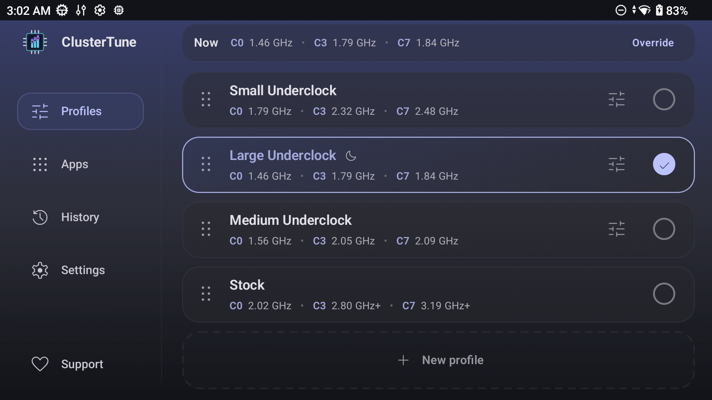
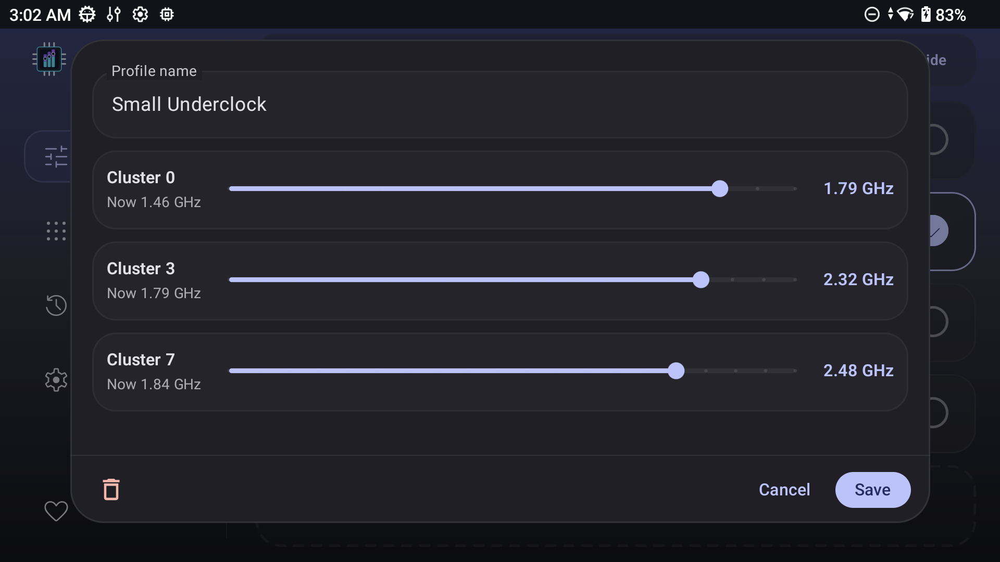
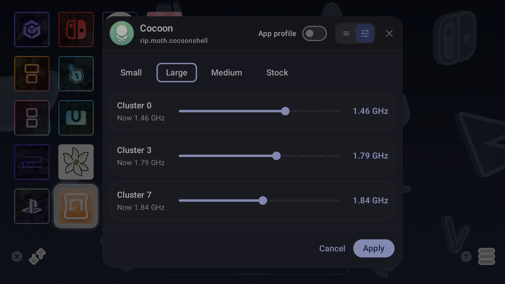
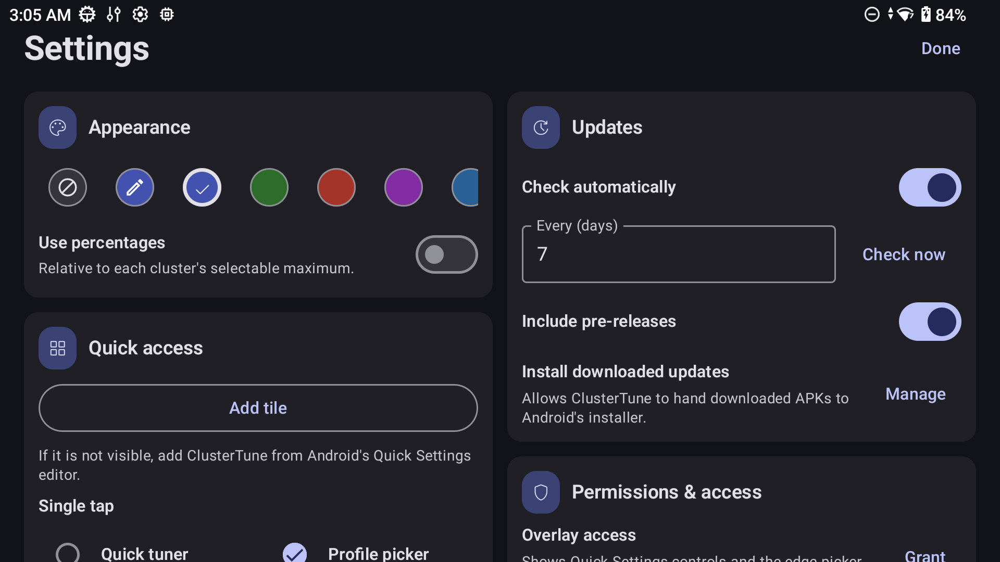

<h1>
  
  ClusterTune
</h1>


<a href="https://ko-fi.com/J3J518XVKR" target="_blank"></a>

ClusterTune sets maximum CPU and GPU frequencies on Android handhelds.

> [!WARNING]
> Changing CPU limits can affect stability, performance, temperature, and battery life. Start with tested values and use **Stock** to restore normal limits.

## Why underclock?

Lower CPU limits can reduce power use, heat, fan noise, and battery drain. Games limited by the GPU may also gain thermal or power headroom. This only caps clock speed and does not undervolt the CPU or replace its governor.

## Features

* Support for rooted Android 12+ devices through `su`
* Independent maximum frequency controls for each CPU cluster and supported GPUs
* Profiles that can be created, reordered, imported, and exported
* Bundled presets and a Stock profile for supported processors
* Automatic app profiles using saved profiles or custom frequency values across one or more displays
* Quick Settings access to pick, tune, or cycle profiles
* A left edge gesture that opens profile controls over the current app
* Optional profile automation after boot and while asleep
* A history of automatic profile switches

## Compatibility

Version 1.0 adds support for rooted devices, expanding compatibility beyond AYN and Retroid hardware.

| Method | Devices |
| --- | --- |
| **PServer** | AYN and Retroid devices with the built in PServer service, except Odin 2 Mini |
| **Root** | Any Android 12+ device with a working `su` shell |

Detection tries PServer first, then Root. The Odin 2 Mini must use Root. If neither method is available, tuning cannot be applied.

## Install

Download [v1.2.2](https://github.com/AurelioB/ClusterTune/releases/tag/v1.2.2) and install `ClusterTune-v1.2.2.apk`.

Android may ask the browser or file manager for permission to install the APK. **Install downloaded updates** is separate and optional. It is only needed for updates installed from inside the app.

## Setup

Execution method detection runs on first launch. Approve the `su` request if Root is selected. Any missing access is listed with a shortcut to the correct Android settings page.

| Access | Purpose |
| --- | --- |
| **Display over other apps** | Opens profile controls over the current app. |
| **Accessibility** | Detects visible apps immediately for automatic profiles. |
| **Notifications** | Keeps app profile and sleep automation active. |
| **Usage access** (optional) | Improves recent app sorting when choosing an app. |

Choose a bundled profile or create one. **Stock** restores the device's normal maximum frequencies.

## Screenshots

| Main app | Profile editor |
| --- | --- |
|  |  |

| Quick tuner overlay | Settings |
| --- | --- |
|  |  |

## Troubleshooting and support

* No execution method found: confirm that PServer is available or that the root manager provides `su`, then run detection again from Settings.
* Profile controls missing: check Display over other apps.
* Assigned app not switching profiles: confirm its assignment, Accessibility, and Notifications.

For help, open a [GitHub issue](https://github.com/AurelioB/ClusterTune/issues) with your device model, Android version, execution method, and the relevant log details. Please do not include private data.

## Build and test

Building requires JDK 17 and Android SDK 34:

```bash
./gradlew testDebugUnitTest
./gradlew lintDebug
./gradlew assembleDebug
```

The debug APK is written to `app/build/outputs/apk/debug/`.

## License and attribution

Distributed under the GNU General Public License v2.0.

The RootExec/PServer command execution code is based on [O2P Tweaks](https://github.com/FeralAI/o2ptweaks.app) by FeralAI, also licensed under GPLv2.

The project was inspired by the [Odin 3 CPU Underclock](https://github.com/TheOldTaylor/Odin3-CPU-Underclock) scripts and the original idea shared by Reddit users [u/twoohfive205](https://www.reddit.com/user/twoohfive205/) and [u/JoaozaoS](https://www.reddit.com/user/JoaozaoS/).

## AI assistance disclosure

AI assistance was used while building this project. I reviewed the code throughout development and understand how the app works and what it does.
